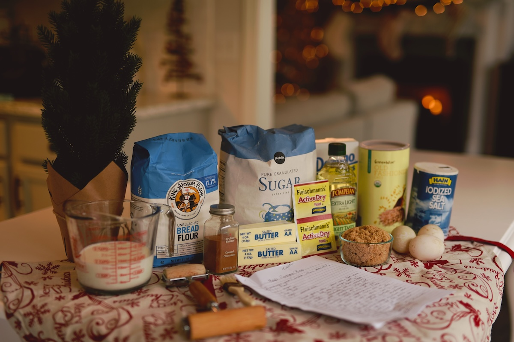
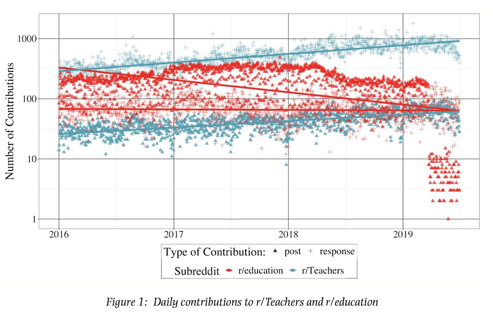
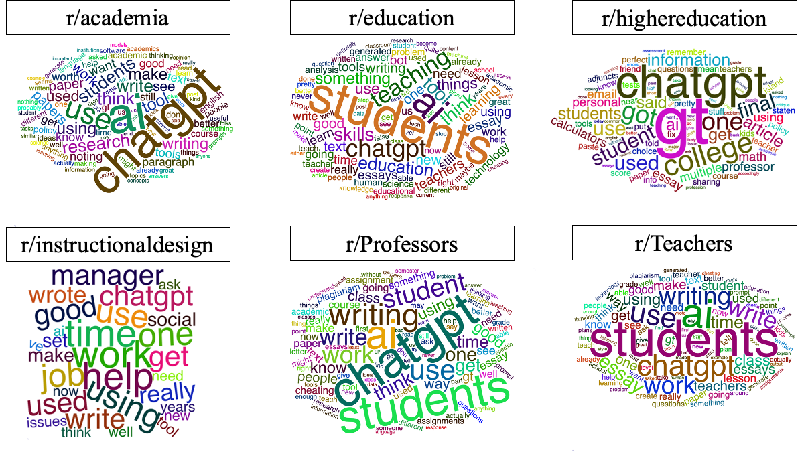
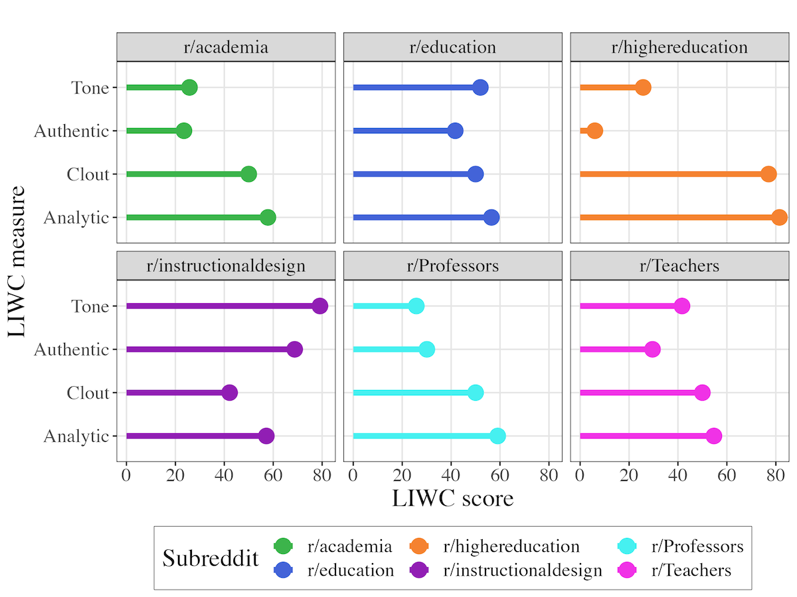
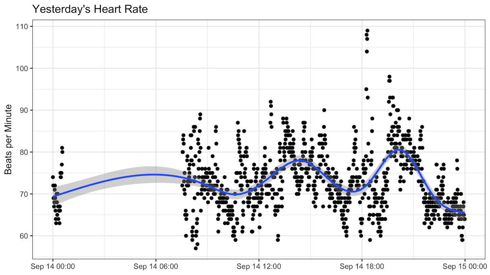

```{r setup, include=FALSE}
usethis::use_git_ignore(c("*.csv", "*.rds"))
options(htmltools.dir.version = FALSE)

library(knitr)
library(tidyverse)
library(xaringan)
library(fontawesome)
```

class: inverse, center, middle

# `r fa("fas fa-images", fill = "#fff")`

**View the slides:** 

[bretsw.com/eme6356-su25-module1](https://bretsw.com/eme6356-su25-module1)

---

class: inverse, center, middle

# `r fa("fas fa-door-open", fill = "#fff")` <br><br> Welcome to EME6356!

---

class: inverse, center, middle

# `r fa("far fa-handshake", fill = "#fff")` Say hello...

```{r, out.width = "600px", echo = FALSE, fig.align = "center"}
include_graphics("img/wave.jpg")
```

--

### if you're interested in applying analytics in...

---

class: inverse, center, middle

# K-12 schools

---

class: inverse, center, middle

# Higher education

---

class: inverse, center, middle

# Military

---

class: inverse, center, middle

# Healthcare and wellness

---

class: inverse, center, middle

# Business

---

class: inverse, center, middle

# `r fa("far fa-handshake", fill = "#fff")` Keep connecting!

```{r, out.width = "600px", echo = FALSE, fig.align = "center"}
include_graphics("img/wave.jpg")
```

---

class: inverse, center, middle

# `r fa("fas fa-sink", fill = "#fff")` <br><br> What is "analytics"?

---

class: inverse, center, middle

# `r fa("fas fa-sink", fill = "#fff")` <br><br> A sink full of dishes...

---

# `r fa("fas fa-sink", fill = "#fff")` Great British Bake Off

```{r, out.width = "840px", echo = FALSE, fig.align = "center"}

```

---

# `r fa("fas fa-sink", fill = "#fff")` Choices of ingredients

```{r, out.width = "840px", echo = FALSE, fig.align = "center"}

```

---

# `r fa("fas fa-sink", fill = "#fff")` A sink full of dishes...

```{r, out.width = "840px", echo = FALSE, fig.align = "center"}

```

---

class: inverse, center, middle

# `r fa("fas fa-pen", fill = "#fff")` <br><br> Defining "Analytics"

---

# `r fa("fas fa-pen", fill = "#fff")` Defining *learning analytics*

--

- Measurement

--

- Collection

--

- Analysis

--

- Reporting

--

...of data about learners and their contexts, 

--

for purposes of understanding and optimising learning and the environments in which it occurs.

--

<div class="caption">
<p><a href="https://www.solaresearch.org/about/what-is-learning-analytics/" target="_blank">Society for Learning Analytics Research (SoLAR)</a></p>
</div>

---

# `r fa("fas fa-pen", fill = "#fff")` Working definition of *analytics*

```{r, out.width = "560px", echo = FALSE, fig.align = "center"}

```

--

**Purpose:** measuring, collecting, analyzing, reporting... with lots of data

--

**Trade-offs:** different than working "by hand" but can include both quantitative and qualitative data

--

**Situated identity:** who *does* analytics?

---

class: inverse, center, middle

# `r fa("fas fa-thumbtack", fill = "#fff")` <br><br> Quick Examples of Analytics

---

# `r fa("fas fa-thumbtack", fill = "#fff")` LMS logins

```{r, out.width = "100%", echo = FALSE, fig.align = "center"}
include_graphics("img/1-lms-logins.png")
```

---

# `r fa("fas fa-thumbtack", fill = "#fff")` Class conversation patterns

```{r, out.width = "560px", echo = FALSE, fig.align = "center"}
include_graphics("img/1-class-network.png")
```

---

# `r fa("fas fa-thumbtack", fill = "#fff")` Reddit frequencies

```{r, out.width = "720px", echo = FALSE, fig.align = "center"}

```

<div class="caption">
<p>
Staudt Willet, K. B., & Carpenter, J. P. (2021). A tale of two subreddits: Change and continuity in teaching-related online spaces. <em>British Journal of Educational Technology, 52</em>(2), 714-733. <a href="https://doi.org/10.1111/bjet.13051" target="_blank">doi:10.1111/bjet.13051</a>
</p>
</div>

---

# `r fa("fas fa-thumbtack", fill = "#fff")` Reddit conversations

```{r, out.width = "720px", echo = FALSE, fig.align = "center"}

```

---

# `r fa("fas fa-thumbtack", fill = "#fff")` Reddit conversations

```{r, out.width = "720px", echo = FALSE, fig.align = "center"}

```

---

# `r fa("fas fa-thumbtack", fill = "#fff")` Predicting Heart Rate

```{r, out.width = "100%", echo = FALSE, fig.align = "center"}

```

--

**Analytics is really just fancy math.**

---

class: inverse, center, middle

# `r fa("fas fa-exclamation", fill = "#fff")` <br><br> What is "analytics" *not*?

---

# `r fa("fas fa-exclamation", fill = "#fff")` Analytics is not...

```{r, out.width = "560px", echo = FALSE, fig.align = "center"}

```

--

- magic

--

- a substitute teacher

--

- a test proctor

--

- oil


---

class: inverse, center, middle

# `r fa("fas fa-binoculars", fill = "#fff")` <br><br> Looking ahead


---

class: inverse, center, middle

# `r fa("fas fa-otter", fill = "#fff")` <br><br> Analytics Sandbox

https://bretsw.com/sandbox/


---

# `r fa("fas fa-calendar-day", fill = "#fff")` Semester schedule

--

- **Module 1:** Intro to Analytics

--

- **Module 2:** Performance Analytics

- **Module 3:** Learning Analytics

- **Module 4:** Web Analytics

--

- **Module 5:** Data Visualization

--

- **Module 6:** Ethics in Learning Analytics

- **Module 7:** Future of Analytics

--

- **Module 8:** Case Discussions

---

# `r fa("fas fa-calendar-day", fill = "#fff")` Module structure

```{r, out.width = "480px", echo = FALSE, fig.align = "center"}

```

--

- `r fa("video", fill = "#782F40")` Watch

--

- `r fa("compass", fill = "#782F40")` Explore

--

- `r fa("book-open", fill = "#782F40")` Read

--

- `r fa("comments", fill = "#782F40")` Discuss

--

- `r fa("fas fa-keyboard", fill = "#782F40")` Create

---

# `r fa("fas fa-calendar-day", fill = "#fff")` Major Assignments

```{r, out.width = "480px", echo = FALSE, fig.align = "center"}

```

### Analytics Assignments: Team Project (60%)

--

- Analytics Problem Plan (100 points)

--

- Analytics Practice (200 points)

--

- Analytics Case Presentation (200 points)

--

- Analytics Ethics Statement (100 points)


---

class: inverse, center, middle

# `r fa("fas fa-question", fill = "#fff")` <br><br> Questions

<hr>

**What questions can I answer for you now?**

**How can I support you this week?**

<hr>

`r fa("envelope", fill = "#fff")` [bret.staudtwillet@fsu.edu](mailto:bret.staudtwillet@fsu.edu) `r fa("globe", fill = "#fff")` [bretsw.com](https://bretsw.com) | `r fa("fab fa-github", fill = "#fff")` [GitHub](https://github.com/bretsw/)